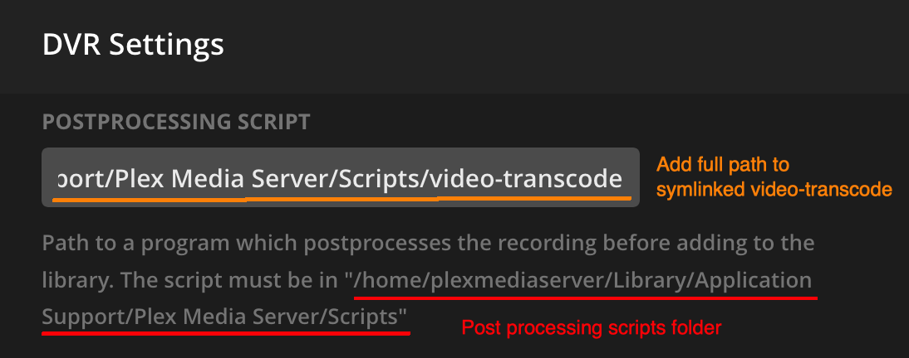

# video-transcode

Simplified commercial cutting and transcoding for Plex DVR. 

video_transcode removes commercials and transcodes Plex recorded TV shows to smaller file. A 60 minute DVR show starting at ~5GB mpeg2 .ts file is reduced to a ~40-42 minute ~800MB h.265 .mkv file with little quality loss.

The service also supports Nvidia GPU transcoding, controls how intensive transcoding is on a machine and what time of day trnascoding can happen. e.g. only transcode overnight, limit 1 transcode at a time, etc.
 

- Quickstart
- How do I use this?
- Docker Setup
- Configuration Options
- Manual installation


## Quickstart

1. Install video_transcode with `pip install video_transcode`
2. Create docker-compose.yaml

    ```docker
    version: '3'
    services:
        redis:
            restart: unless-stopped
            image: redis:alpine
            ports:
                - "6124:6379"
        video:
            image: kirb5/video-transcode
            restart: unless-stopped
            depends_on:
                - "redis"
            volumes: 
                # REQUIRED! Folder containing Plex DVR recordings on host must be maped to /home/plex inside container
                - ./plex:/home/plex

    ```

3. Start `docker-compose up`
4. Add a video file to the transcoding queue with `video-transcode "MacGyver - S04E01 - Fire + Ashes + Legacy = Phoenix.ts"`


# Usage
## Basic usage
`video-transcode input_file.ts`

## Plex postprocessing setup 
Configuring Plex to use video-transcode for post processing requires:
1. Symlink video-transcode executable to DVR post processing script folder. The exact path to this folder is visible within Plex DVR settings under Postprocessing Script (see red highlight below). 
```bash
$ ln -s $( which video-transcode ) /path/to/plex/Library/Application/Support/Plex\ Media\ Server/Scripts/video-transcode
```
2. Add absolute path of symlink to Postprocessing Script section in DVR settings (see orange highlight below).




# Docker
Docker image is prebuilt with Nvidia HEVC and AVC encoding/decoding support for GPU accellerated transcodes. The image requires access to a Redis server. Specify the server's URL in CELERY_BROKER and CELERY_RESULT_BACKEND keys in video_transcode/config/config.yaml

## Nvidia GPU Transcoding (NVENC)
#### Prerequisites
Docker 19.03+ and (nvidia-container-toolkit)[https://github.com/NVIDIA/nvidia-docker] are required for GPU transcoding. ffmpeg built with cuvid and nvenc support using nv-codec-headers 9.1.23.1, CUDA 10.2 and Nvidia driver 440.82.

#### Setup
As of 7/2/20 docker-compose does not support `--gpus` flag in Docker 19.03. Manually setting up the service is the only option for now.
1. Install video_transcode with pip
2. Create network in docker
3. Create redis container
4. Create video_transcode container


# Configuration
#### video_transcode

#### celery


# Manual Installation
1. Install ffmpeg
2. Install redis 
3. Install comchap
4. Install comskip
3. Install video-transcode
4. make
5. start service
6. Add video-transcode script path to Plex post processing.


# Architecture
video_transcode stack includes:
- ffmpeg
- Compskip/comchap
- celery
- redis


# To Do
- Configurable UID/GID
- Pass additional ffmpeg options
- Port comcut to Python

